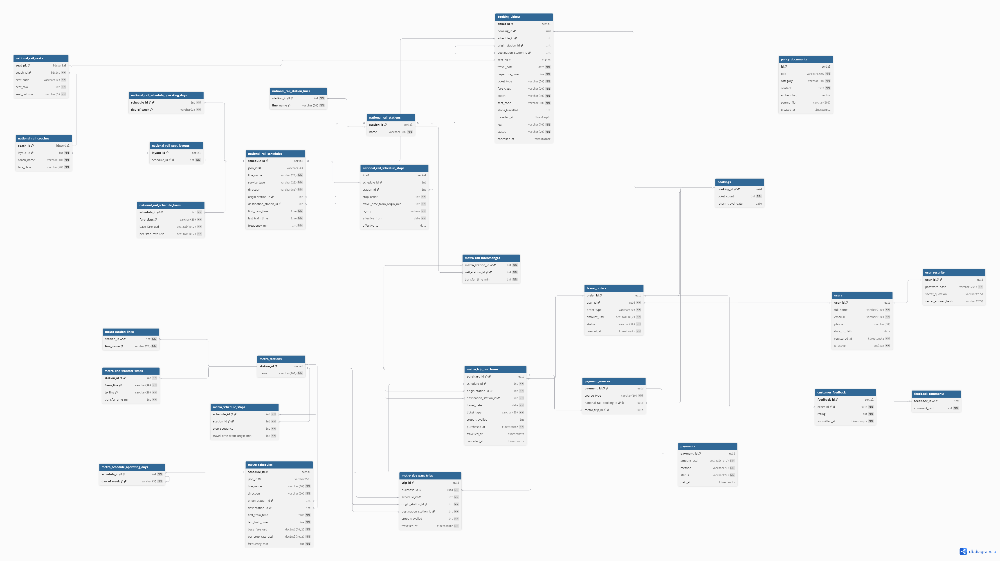

# Team 02 — TransitFlow Database Design Document

---

## Mark Summary

| Section | Max |
|---------|-----|
| Section 1 — Entity-Relationship Diagram | 25 |
| Section 2 — Normalisation Justification | 20 |
| Section 3 — Graph Database Design Rationale | 25 |
| Section 4 — Vector / RAG Design | 15 |
| Section 5 — AI Tool Usage Evidence | 10 |
| Section 6 — Reflection & Trade-offs | 5 |
| **Total** | **100** |

---

## Section 1 — Entity-Relationship Diagram



### Entities and Key Attributes

| Entity | PK | Key FKs | Representative Attributes |
|---|---|---|---|
| `users` | `user_id` UUID | — | `full_name`, `email`, `is_active` |
| `user_security` | `user_id` UUID | → `users` | `password_hash`, `secret_question`, `secret_answer_hash` |
| `metro_stations` | `station_id` SERIAL | — | `name` |
| `metro_station_lines` | (`station_id`, `line_name`) | → `metro_stations` | `line_name` |
| `metro_line_transfer_times` | (`station_id`, `from_line`, `to_line`) | → `metro_stations` | `transfer_time_min` |
| `national_rail_stations` | `station_id` SERIAL | — | `name` |
| `national_rail_station_lines` | (`station_id`, `line_name`) | → `national_rail_stations` | `line_name` |
| `metro_rail_interchanges` | (`metro_station_id`, `rail_station_id`) | → `metro_stations`, → `national_rail_stations` | `transfer_time_min` |
| `metro_schedules` | `schedule_id` SERIAL | → `metro_stations` (origin, dest) | `line_name`, `base_fare_usd`, `frequency_min` |
| `metro_schedule_stops` | (`schedule_id`, `station_id`) | → `metro_schedules`, → `metro_stations` | `stop_sequence`, `travel_time_from_origin_min` |
| `metro_schedule_operating_days` | (`schedule_id`, `day_of_week`) | → `metro_schedules` | `day_of_week` |
| `national_rail_schedules` | `schedule_id` SERIAL | → `national_rail_stations` (origin, dest) | `line_name`, `service_type`, `frequency_min` |
| `national_rail_schedule_stops` | `id` SERIAL | → `national_rail_schedules`, → `national_rail_stations` | `stop_order`, `is_stop`, `effective_from`, `effective_to` |
| `national_rail_schedule_operating_days` | (`schedule_id`, `day_of_week`) | → `national_rail_schedules` | `day_of_week` |
| `national_rail_schedule_fares` | (`schedule_id`, `fare_class`) | → `national_rail_schedules` | `base_fare_usd`, `per_stop_rate_usd` |
| `national_rail_seat_layouts` | `layout_id` SERIAL | → `national_rail_schedules` | — |
| `national_rail_coaches` | `coach_id` BIGSERIAL | → `national_rail_seat_layouts` | `coach_name`, `fare_class` |
| `national_rail_seats` | `seat_pk` BIGSERIAL | → `national_rail_coaches` | `seat_code`, `seat_row`, `seat_column` |
| `travel_orders` | `order_id` UUID | → `users` | `order_type`, `amount_usd`, `status`, `created_at` |
| `bookings` | `booking_id` UUID | → `travel_orders` | `ticket_count`, `return_travel_date` |
| `booking_tickets` | `ticket_id` SERIAL | → `bookings`, → `national_rail_schedules`, → `national_rail_stations` (×2), → `national_rail_seats` | `travel_date`, `ticket_type`, `fare_class`, `status`, `leg` |
| `metro_trip_purchases` | `purchase_id` UUID | → `travel_orders`, → `metro_schedules`, → `metro_stations` (×2) | `ticket_type`, `travel_date`, `stops_travelled` |
| `metro_day_pass_trips` | `trip_id` UUID | → `metro_trip_purchases`, → `metro_schedules`, → `metro_stations` (×2) | `stops_travelled`, `travelled_at` |
| `payments` | `payment_id` UUID | — | `amount_usd`, `method`, `status`, `paid_at` |
| `payment_sources` | `payment_id` UUID | → `payments`, → `bookings`, → `metro_trip_purchases` | `source_type`, `national_rail_booking_id`, `metro_trip_id` |
| `customer_feedback` | `feedback_id` SERIAL | → `travel_orders` | `rating`, `submitted_at` |
| `feedback_comments` | `feedback_id` INT | → `customer_feedback` | `comment_text` |

### Key Cardinality Relationships

| Relationship | Cardinality |
|---|---|
| `users` → `travel_orders` | 1 : N |
| `travel_orders` → `bookings` | 1 : 1 |
| `travel_orders` → `metro_trip_purchases` | 1 : 1 |
| `bookings` → `booking_tickets` | 1 : N |
| `metro_trip_purchases` → `metro_day_pass_trips` | 1 : N |
| `metro_schedules` → `metro_schedule_stops` | 1 : N |
| `metro_stations` ↔ `metro_station_lines` | 1 : N |
| `metro_stations` ↔ `national_rail_stations` (via `metro_rail_interchanges`) | M : N |
| `national_rail_schedules` → `national_rail_schedule_fares` | 1 : N (one per fare class) |
| `national_rail_seat_layouts` → `national_rail_coaches` → `national_rail_seats` | 1 : N : N |
| `payments` → `payment_sources` | 1 : 1 |
| `customer_feedback` → `feedback_comments` | 1 : 1 (optional) |

---

## Section 2 — Normalisation Justification

### 2.1 Third Normal Form (3NF) Design Decisions

#### ① Schedule Stops Extracted into Junction Tables

Metro and national rail stop sequences are stored in dedicated junction tables (`metro_schedule_stops`, `national_rail_schedule_stops`) rather than as array columns inside the schedule row.

The relevant functional dependency is: each stop's attributes — which station it is, and the cumulative travel time from the origin — are determined jointly by `(schedule_id, stop_sequence)`, not by `schedule_id` alone. Storing stops as an array column (e.g., `stops TEXT[]`) would violate First Normal Form (1NF), because a single column would contain a repeating group, and the database could not enforce a foreign-key constraint on each individual `station_id` inside the array. Extracting stops into a separate table with an explicit `stop_sequence` column achieves 3NF: every non-key attribute depends on the full composite key, with no partial dependency and no transitive dependency.

This design also allows queries such as "find all stops between station A and station B on a given schedule" to be expressed with a simple `WHERE stop_sequence BETWEEN ? AND ?` filter. With an array column, the application layer would have to parse and slice the array at runtime, which is both slower and harder to index.

#### ② `metro_line_transfer_times` Extracted into a Separate Table (Eliminating Transitive Dependency)

Transfer times between metro lines could in principle be stored inside `metro_station_lines` — since transfer information is related to station lines, placing it in the same table seems natural. However, a transfer time is determined by the triple `(station_id, from_line, to_line)`, not by the composite key `(station_id, line_name)` alone. Storing `transfer_time_min` in `metro_station_lines` would therefore create a **transitive dependency** — a non-key attribute depending on a set of columns that is not the table's primary key — which violates 3NF.

Extracting transfer times into `metro_line_transfer_times(station_id, from_line, to_line)` eliminates this transitive dependency: `transfer_time_min` now depends directly and fully on its own primary key. The table also includes a `CHECK (from_line < to_line)` direction normalisation constraint, ensuring that `(M1 → M2)` and `(M2 → M1)` are never stored as two separate rows. Transfer time is assumed symmetric, so the application reads a single row for both directions.

---

### 2.2 Deliberate De-normalisation

The schema includes three intentional de-normalisation decisions. Each is justified by a concrete performance or semantic reason.

#### ① Cache Columns on `bookings`: `ticket_count` and `return_travel_date`

Strict 3NF would require both values to be computed dynamically: `ticket_count` via a `COUNT(*)` aggregation over `booking_tickets`, and `return_travel_date` via a JOIN filtering `booking_tickets` for `leg = 'inbound'`. However, displaying a booking summary is the most frequent read operation in the system, and performing an aggregation and a JOIN on every such read creates unnecessary overhead.

Both columns are maintained automatically by database triggers (`trg_sync_ticket_count` and `trg_sync_return_travel_date`), which fire on every INSERT, UPDATE, and DELETE on `booking_tickets` and keep the cached values in sync. The application layer never needs to update these columns manually. This approach captures the read-performance benefit of de-normalisation while ensuring data consistency is enforced at the database layer rather than relying on application discipline.

#### ② Multi-Column FK Design in `payment_sources` (Polymorphic Association De-normalisation)

`payment_sources` has two nullable FK columns — `national_rail_booking_id` and `metro_trip_id` — together with a CHECK constraint (`chk_source_type_and_fields`) that enforces exactly one non-NULL value. A strict 3NF alternative would use a polymorphic base table: introduce an abstract `orders` parent table, have `payment_sources` point to it with a single FK, and let the base table dispatch downward to either `bookings` or `metro_trip_purchases`.

However, this would require three-level JOINs to retrieve the order details behind any payment, and every new order would require an insert into the base table first, increasing write complexity. The schema instead uses two nullable columns with a CHECK constraint in place of the abstract base table. This sacrifices a small amount of storage in exchange for a more direct query path and a more readable data structure. If a third order type is added in the future, only one new column and one additional OR branch in the CHECK constraint are needed — the `payments` table itself never needs to change.

#### ③ Split Between `metro_trip_purchases` and `metro_day_pass_trips`

Under strict 3NF, all metro travel records could be stored in a single table. However, a day pass covers multiple journeys under a single payment. If each journey were recorded as a separate row in `travel_orders`, it would break the invariant that one order equals one payment amount, and it would inflate the orders table unnecessarily.

The solution is to separate the **payment event** (`metro_trip_purchases` — one row per day pass purchase) from the **travel events** (`metro_day_pass_trips` — one row per individual journey). Payment aggregation queries — for example, calculating daily revenue — only need to scan `metro_trip_purchases` and do not need to touch the individual journey detail records. This is a deliberate trade-off: slight structural redundancy in exchange for clearer payment semantics and better query performance.

---

### 2.3 Password Hashing — Algorithm Choice, Rationale, and Salt Management

Passwords and secret answers are stored as **Argon2id** hashes in `user_security`, using the PHC (Password Hashing Competition) string format, implemented via the `argon2-cffi` library.

**Why Argon2id instead of MD5 or SHA-family algorithms:**
MD5 and SHA-256 are general-purpose hash functions designed for speed. A modern GPU can compute billions of SHA-256 hashes per second, making brute-force or dictionary attacks feasible within hours of a database leak. Argon2id is a memory-hard adaptive hash function, deliberately designed to be slow and to require a large amount of RAM per evaluation. This means that hardware speed improvements do not translate proportionally into faster attacks — each attempt consumes both significant CPU time and memory, making GPU-parallel brute-force attacks economically infeasible.

**Why Argon2id instead of bcrypt:**
bcrypt is an older adaptive hash function and is also acceptable, but it has two limitations: it truncates passwords at 72 characters, and it is not memory-hard. Argon2id won the Password Hashing Competition in 2015 precisely because it supports both a time cost parameter (iteration count) and a memory cost parameter, making it resistant to both CPU and GPU attacks. It is also the current OWASP-recommended standard for new systems.

**How salt prevents rainbow-table attacks:**
A rainbow table is a precomputed lookup table mapping common passwords to their hash values. Without a salt, two users with the same password would produce identical hash strings, and a single table lookup would expose both accounts simultaneously. Argon2id generates a cryptographically random salt on every hash operation and encodes it directly into the output string (PHC format: `$argon2id$v=19$m=65536,t=2,p=2$<salt>$<hash>`). Because every hash has a unique salt, two users with identical passwords produce completely different stored strings, rendering rainbow tables useless — an attacker would need to recompute an entire rainbow table for each unique salt, which is computationally infeasible.

No separate `salt` column is needed: the PHC string is a self-contained format, and the `argon2-cffi` verifier automatically extracts the salt from it during login verification.

**Additional protection for secret answers:**
`user_security.secret_answer_hash` stores the secret answer using the same Argon2id algorithm. This ensures that even if the database is leaked, an attacker cannot recover the plaintext secret answer and use it to reset a password.

---

### 2.4 Database Terminology Reference

| Term | Where Applied in This Schema |
|------|------------------------------|
| **Functional Dependency** | `(schedule_id, stop_sequence) → station_id`, applied in `metro_schedule_stops` and `national_rail_schedule_stops` |
| **Candidate Key** | `(schedule_id, station_id)` in `metro_schedule_stops`; `(station_id, from_line, to_line)` in `metro_line_transfer_times` |
| **Transitive Dependency** | Eliminated by separating `metro_line_transfer_times` from `metro_station_lines` (removing `transfer_time_min`'s dependency on non-key line attributes); also eliminated by separating `user_security` from `users` |
| **Repeating Group** | Avoided by extracting stop lists into junction tables instead of storing them as array columns |
| **Partial Dependency** | Avoided in `national_rail_schedule_fares` — `base_fare_usd` and `per_stop_rate_usd` depend on the full composite key `(schedule_id, fare_class)`, not on `schedule_id` alone |
| **De-normalisation** | `bookings.ticket_count` and `return_travel_date` as trigger-maintained cache columns; `booking_tickets.coach` and `seat_code` as display-purpose redundant columns; `payment_sources` using dual nullable FKs instead of a polymorphic base table |

---

## Section 3 — Graph Database Design Rationale

### 3.1 Design Decisions for Nodes, Relationships, and Properties

**Nodes:** Stations are modelled as nodes, using two primary labels: `MetroStation` (metro stations) and `NationalRailStation` (national rail stations). In practice, each node carries a triple label — metro stations use `:Station:Metro:MetroStation` and national rail stations use `:Station:NationalRail:NationalRailStation`. The `:Station` label supports global queries across both networks; `:Metro` / `:NationalRail` enables single-network filtering; and `:MetroStation` / `:NationalRailStation` aligns with the terminology used in the marking specification.

Stations are modelled as nodes because they are independent entities with their own identity — routing queries are fundamentally about "how do I get from station A to station B?", making stations the natural subject of every query. Each node stores three properties: `station_id` (fully aligned with the PostgreSQL primary key, e.g. `"MS01"`), `name` (human-readable station name), and `lines` (a native array of line IDs, e.g. `["M1","M2"]`, which supports efficient filtering with `"M1" IN s.lines`).

**Relationships:** Three relationship types are defined:

- `METRO_LINK` — connections between adjacent metro stations, stored bidirectionally (A→B and B→A as separate edges)
- `RAIL_LINK` — connections between adjacent national rail stations, also stored bidirectionally
- `INTERCHANGE_TO` — cross-network connections between metro and national rail stations, corresponding to the `metro_rail_interchanges` table in PostgreSQL (three pairs: MS01↔NR01, MS07↔NR03, MS15↔NR07)

A connection between two stations only has meaning when both stations exist, and it links exactly two entities — this fits the definition of a relationship rather than a node. All relationships are stored bidirectionally so that Dijkstra can traverse them without using an undirected pattern (which is slower in Neo4j).

**Properties:** Properties are stored on relationships rather than in separate tables because they are always accessed together with the traversal — normalising them out would provide no benefit. `travel_time_min` on `METRO_LINK` and `RAIL_LINK` serves as the numeric weight for Dijkstra's shortest-path algorithm. The `line` property is included in the MERGE key so that when two adjacent stations are served by multiple lines, each line gets its own edge and they do not overwrite each other.

`METRO_LINK` additionally stores `base_fare_usd` and `per_stop_rate_usd`. `RAIL_LINK` stores eight fare columns expanded inline (e.g. `normal_standard_fare_usd`, `express_first_per_stop_rate_usd`) because national rail has both `normal`/`express` service types and `standard`/`first` fare classes on the same route. These are read directly by `query_cheapest_route` without any additional JOINs. `INTERCHANGE_TO` stores no `line` property (a platform walk does not belong to any specific line) and a fixed `travel_time_min = 5` (assumed walking time).

---

### 3.2 Why a Graph Database is Superior to a Relational Database for Routing

TransitFlow's routing queries would require a **Recursive Common Table Expression (CTE)** in a relational database:

```sql
WITH RECURSIVE path AS (
    SELECT station_id AS current, 0 AS total_time,
           ARRAY[station_id] AS visited
    FROM metro_stations WHERE station_id = 'MS01'
    UNION ALL
    SELECT l.to_station_id,
           p.total_time + l.travel_time_min,
           p.visited || l.to_station_id
    FROM path p
    JOIN metro_links l ON l.from_station_id = p.current
    WHERE l.to_station_id <> ALL(p.visited)
)
SELECT * FROM path WHERE current = 'MS09'
ORDER BY total_time LIMIT 1;
```

This approach must materialise and re-scan the entire adjacency table at every recursion level, with no priority queue to prune already-settled nodes. PostgreSQL's recursive CTE behaves like breadth-first search with O(V × E) row scans, while Neo4j's Dijkstra settles each node at most once at O((V + E) log V). As the network grows, the SQL approach degrades quadratically; the graph approach does not.

In Cypher, the same query is a single statement:

```cypher
MATCH (start:MetroStation {station_id: $origin}),
      (end:MetroStation {station_id: $destination})
CALL apoc.algo.dijkstra(start, end, "METRO_LINK", "travel_time_min")
YIELD path, weight
RETURN [n IN nodes(path) | n.station_id] AS path,
       weight AS total_time_min
```

The `query_delay_ripple` function further illustrates the SQL disadvantage: in Cypher, `MATCH (s)-[:METRO_LINK|RAIL_LINK|INTERCHANGE_TO*0..N]->(affected)` expresses variable-depth reachability in a single pattern. In SQL, this would require N separate self-joins combined with UNION, or a recursive CTE that cannot exploit depth-bounded pruning — making a cross-network delay ripple query practically infeasible in pure SQL.

---

### 3.3 Two Query Types Enabled by the Graph Model

**① Shortest-time route (`query_shortest_route`)**

This query uses APOC Dijkstra (`apoc.algo.dijkstra`) with `travel_time_min` as the edge weight to find the path between two stations with the lowest total travel time. The graph model supports this directly: `travel_time_min` is stored on each `METRO_LINK` / `RAIL_LINK` relationship and is read during traversal without any cross-table JOINs. The result includes a full `path` object (containing every station and leg in order) and `total_time_min`. Returning a path object of this form in a relational CTE would require manually accumulating arrays at every recursion level, which is both verbose and fragile.

**② Cross-network interchange path (`query_interchange_path`)**

This query starts from a metro station, crosses the network boundary via an `INTERCHANGE_TO` relationship, and arrives at a national rail destination (or vice versa). The `INTERCHANGE_TO` design allows the graph model to express "transferring between two systems at the same physical location" naturally — a path can seamlessly move from a `:MetroStation` node to a `:NationalRailStation` node, with all three relationship types traversable in a single Cypher pattern. In a relational database, metro and national rail station tables are separate entities connected only through `metro_rail_interchanges`; a cross-network query would require manually UNIONing three different adjacency tables and managing interchange logic explicitly — it cannot be expressed as a unified path traversal.

---

### 3.4 Node Identity

Each node is uniquely identified by the `station_id` property (e.g. `"MS01"` for metro, `"NR01"` for national rail). This property was chosen as the node identity key for three reasons:

First, `station_id` is fully aligned with the PostgreSQL station primary keys, so the graph and relational layers share a common lookup identifier without requiring an extra mapping table between the two databases.

Second, the string prefix (`MS` for metro, `NR` for national rail) encodes network membership directly in the identifier. The routing helper function `_rel_types()` infers which relationship types to traverse purely from the station ID prefixes, without needing to query node labels separately.

Third, PostgreSQL's `SERIAL` integer keys are not globally unique across both networks — both metro and national rail station sequences start from 1, so `station_id = 1` is ambiguous. The prefixed string ID is the only scheme that guarantees global uniqueness across both networks without a separate disambiguation column.

---

## Section 4 — Vector / RAG Design

### 4.1 What is Embedded and Why Cosine Similarity

The system embeds **policy documents** — specifically the content from four JSON files: `refund_policy.json`, `ticket_types.json`, `booking_rules.json`, and `travel_policies.json`. Each document entry is serialised to a text string and converted into a numeric vector via an embedding model, then stored in the `policy_documents.embedding` column.

**Cosine similarity** is chosen as the similarity metric because it measures the **directional similarity** between two vectors in high-dimensional space, independent of their absolute magnitude. The mathematical definition is:

`cos θ = (A · B) / (‖A‖ × ‖B‖)`

A result close to 1.0 means the two vectors point in similar directions (semantically similar); a result close to 0 means they are semantically unrelated. This magnitude-independence is critical for semantic search: a passenger's question (e.g. "can I get a refund if I miss my train?") is typically much shorter than a policy document, so its vector has a smaller magnitude. Cosine similarity normalises out this difference by dividing by each vector's length, comparing direction only. If Euclidean distance (L2) were used instead, shorter query vectors would systematically appear "further away" from longer document vectors even when the semantic content is identical — making L2 a poor fit for question-to-document retrieval.

Additionally, the system applies a similarity threshold of `> 0.5` to filter out results with insufficient semantic relevance, ensuring that only genuinely related policy content is passed to the LLM.

---

### 4.2 Full RAG Pipeline

**Step 1 — Query Embedding**

When the user submits a question, `skeleton/agent.py` calls `llm.embed(user_question)`, using the exact same embedding model that was used during seeding. This converts the question text into a numeric vector (768 dimensions or 3072 dimensions, depending on the provider). Model consistency is essential — the query vector must exist in the same vector space as the stored document vectors for cosine similarity comparisons to be semantically meaningful.

**Step 2 — Similarity Search**

The query vector is passed to `query_policy_vector_search(embedding)`, which runs an approximate nearest-neighbour search against the `policy_documents` table using the HNSW index:

```sql
SELECT title, category, content,
       1 - (embedding <=> %s::vector) AS similarity
FROM policy_documents
WHERE 1 - (embedding <=> %s::vector) > 0.5
ORDER BY embedding <=> %s::vector
LIMIT 3
```

The `<=>` operator is pgvector's cosine distance operator. `ORDER BY embedding <=> query_vec` instructs PostgreSQL to use the HNSW index to find the top 3 documents whose embedding directions are closest to the query vector.

**Step 3 — Retrieved Documents**

The search returns a list of documents containing `title`, `category`, `content`, and `similarity`. These are returned to `agent.py` to serve as the knowledge source for the LLM. This step is the core reason RAG is necessary — the LLM's training data does not include TransitFlow's specific refund rules or booking regulations, so asking the LLM directly would produce generic answers or hallucinations. Retrieving from the database at query time ensures the LLM receives accurate, up-to-date system policy content.

**Step 4 — LLM Prompt and Answer Generation**

`agent.py` injects the retrieved policy document content as context into the prompt alongside the user's original question, then calls the LLM (Gemini or Ollama `llama3.2`). The LLM synthesises the provided context into a natural-language answer — for example, a question about express train refund policy will produce a response that directly cites the RF002 policy, including specific refund percentages and time windows — and the answer is returned to the Gradio UI.

---

### 4.3 Embedding Dimension Choice and the Consequences of Switching Provider

This implementation defaults to **Ollama's `nomic-embed-text` model**, which produces **768-dimensional** vectors. The `policy_documents.embedding` column is declared as `vector(768)` in `schema.sql`, and the HNSW index is built over this dimension with `vector_cosine_ops`.

If the provider is switched to Gemini, the `gemini-embedding-001` model produces **3072-dimensional** vectors, requiring `schema.sql` to be changed to `vector(3072)`.

**The consequences of switching provider without re-seeding are as follows:**

PostgreSQL will immediately raise an `embedding dimension mismatch` error on any insert or query — a `vector(768)` column cannot store or compare a 3072-dimensional vector. More fundamentally, even if the column type were forcibly altered, the HNSW index built over 768-dimensional space becomes unusable and must be dropped and rebuilt from scratch. Because the index and the vector data are interdependent, the correct migration procedure is: update the `vector()` dimension in `schema.sql` → run `docker compose down -v && docker compose up -d` to fully reset the database → re-run `seed_vectors.py` to re-embed all documents with the new model. **All team members must agree on a single provider before the first seed run — mixing providers is not supported.**

---

## Section 5 — AI Tool Usage Evidence

> **Instructions:** Replace the placeholder examples below with your team's actual AI interactions (3–5 examples). Each example must include all three fields: **Context**, **Prompt**, **Outcome**. At least one example must describe a case where the AI output was wrong or needed correction.

---

**Example 1 — Schema Design: ER Diagram Validity Check**

- **Context:** After completing the first version of `schema.sql`, we needed to verify whether the overall ER relationships were sound and to identify potential design problems.
- **Prompt:** *"你是一個資料庫管理大師，我擁有 github（https://github.com/Ariel-hub-121/IM2002-DBMGT-Train-final.git）中的假資料 JSON 檔（忽略 booking_rules.json、refund_policy.json、ticket_types.json、travel_policies.json 這四個檔案，他們屬於 vector 資料庫，不須畫進 ER 圖），請確認此 SQL 建立的 ER 關係是合理的嗎，給我修改建議與選項方案"*
- **Outcome:** The AI provided modification suggestions, but we noticed it incorrectly included Neo4j graph database content from `metro_stations.json` and `national_rail_stations.json` (such as adjacent station relationships) in its PostgreSQL schema recommendations. These adjacency relationships should exist in Neo4j, not in the relational database. We therefore corrected the prompt to explicitly exclude Neo4j content:

  *"你是一個資料庫管理大師，我擁有 github（...）中的假資料 JSON 檔（忽略 booking_rules.json、refund_policy.json、ticket_types.json、travel_policies.json 這四個檔案，他們屬於 vector 資料庫，不須畫進 ER 圖；metro_stations.json、national_rail_stations.json 有關於 Neo4j（圖形資料庫）的部分也不須畫進 ER 圖），請確認此 SQL 建立的 ER 關係是合理的嗎，給我修改建議與選項方案"*

  After the correction, the AI's response correctly focused only on the PostgreSQL relational database design. This is an example where the AI output required correction: the AI could not independently distinguish the responsibility boundaries between the three databases, and only produced correct advice after we explicitly specified the exclusion scope in the prompt.

---

**Example 2 — Seed Implementation: Code Review of `seed_national_rail_bookings`**

- **Context:** After implementing the `seed_national_rail_bookings` function with assistance from Claude in VS Code, we used a dedicated code review prompt to paste the code into the web version of Claude for a thorough review to check for bugs.
- **Prompt:** Used the team's custom Template C review prompt, which asks the AI to check 10 dimensions one by one: column names, return types, connection pattern, transaction integrity, SQL injection, `fetchone` None handling, dual-network logic, fare formula, password handling, and refund logic. The full implementation and relevant schema were attached.
- **Outcome:** The AI correctly identified two real bugs. **Bug 1:** The fallback value for `cancelled_at` used `booked_at` (booking time), which is semantically incorrect — `cancelled_at` should be a cancellation timestamp. Since the JSON data does not contain a `cancelled_at` field, this is a known data gap; the AI recommended adding a clear comment explaining this as a workaround, which we adopted. **Bug 2:** The AI suspected that `seat_id` (in JSON) and `seat_code` (in the database) might have inconsistent value formats, potentially causing `seat_pk_map` lookups to fail. After cross-referencing `national_rail_seat_layouts.json` with the `seed_seat_layouts` implementation, we confirmed the values are identical in both places (both use the format `"B03"`), so Bug 2 was not valid. We adopted Bug 1's recommendation and added an explanatory workaround comment to the code.

---

**Example 3 — Query Implementation: Code Review and Correction of `query_user_bookings`**

- **Context:** After implementing the `query_user_bookings` function, we used the same Template C prompt for review. This function is required to return a dictionary with two keys: `{"national_rail": [...], "metro": [...]}`.
- **Prompt:** Same Template C format, with the stub contract, full implementation, and the relevant schemas for `users`, `travel_orders`, `bookings`, `booking_tickets`, `metro_trip_purchases`, and `metro_stations` attached.
- **Outcome:** The AI identified two real bugs. **Bug 1 (critical):** The metro query completely omitted the `metro_day_pass_trips` sub-table. Day pass journeys are recorded individually in this child table; the original implementation only queried at the purchase event level, meaning all actual journey records for day pass users would never appear in the returned results. **Bug 2:** The national rail `SELECT` list was missing the `bt.travelled_at` column, so the caller could not determine the actual time of travel. The AI also provided three correction options; we selected Option A (two separate queries + Python `setdefault()` merge), as it has the clearest structure and handles the edge case of a day pass with no recorded journeys most robustly.

---

**Example 4**

> TODO: Add example 4 here. Include all three required fields: **Context**, **Prompt**, **Outcome**. If applicable, describe a case where the AI output was wrong and explain how it was identified and corrected.

---

**Example 5**

> TODO: Add example 5 here. Include all three required fields: **Context**, **Prompt**, **Outcome**. If applicable, describe a case where the AI output was wrong and explain how it was identified and corrected.

---

## Section 6 — Reflection & Trade-offs

### 6.1 Design Decisions

**Decision 1: Three-tier PK Strategy (SERIAL / UUID / BIGSERIAL)**

This project uses three primary key types, selected according to each table's usage characteristics. Internal lookup tables that are never exposed to users (stations, schedules, seat layouts, customer feedback) use `SERIAL` (INT). User-visible identifiers (`users`, `travel_orders`, `bookings`, `payments`, etc.) use `UUID DEFAULT gen_random_uuid()`. Internal records that may accumulate very large row counts (`national_rail_coaches`, `national_rail_seats`) use `BIGSERIAL`.

UUID is chosen for user-visible fields to prevent **sequential enumeration attacks** — if SERIAL were used, a passenger who sees `order_id = 1001` in their confirmation email could trivially guess that `1002` is another user's booking. UUID is a random 128-bit value that cannot be predicted. SERIAL is used for internal tables because INT JOINs outperform VARCHAR JOINs and these IDs are never exposed in API responses or URLs. BIGSERIAL is used for the seat and coach tables because these records could accumulate beyond the INT upper bound (~2.1 billion rows) over the system's operational lifetime.

---

**Decision 2: Mixed Delete Strategy (Soft Delete + CASCADE + SET NULL + RESTRICT)**

Different data in this schema uses different deletion strategies. The `users` table uses a soft delete (`is_active = FALSE`) — hard-deleting a user would orphan all historical financial records, violating financial record-retention requirements. Order sub-layer data (`booking_tickets`, `metro_day_pass_trips`, etc.) uses `ON DELETE CASCADE`, because these child records are meaningless without their parent. `booking_tickets.seat_pk` uses `ON DELETE SET NULL`, because a seat may be retired due to rolling stock changes while the historical ticket record must be preserved. `travel_orders.user_id` uses `ON DELETE RESTRICT`, forcing the application layer to soft-delete an account before any deletion can proceed. Every FK explicitly declares its cascade behaviour rather than relying on PostgreSQL defaults, making the schema self-documenting.

---

**Decision 3: Shared Parent Table + Separate Child Tables for National Rail and Metro Orders**

The two booking flows in this system are fundamentally different — national rail requires a specific seat, coach, and fare class, and supports return tickets (two separate outbound/inbound ticket rows); metro requires only an origin and destination, and has a day pass special case where a single payment covers multiple journeys. Merging both into one order table would produce many columns that are only meaningful for one network (e.g. `seat_pk` and `fare_class` are irrelevant for metro; `ticket_type = day_pass` is irrelevant for national rail), violating 3NF.

The solution is a three-layer structure: `travel_orders` serves as the **shared parent table**, storing attributes common to both order types (user, amount, status, created time), with an `order_type` discriminator column. National rail order details are stored in two child tables: `bookings` (order header) and `booking_tickets` (individual ticket rows). Metro order details are stored in two child tables: `metro_trip_purchases` (payment event) and `metro_day_pass_trips` (individual journey records under a day pass).

The benefit of this design is that `query_user_bookings` only needs to JOIN `travel_orders` once and then route to the appropriate child table via `order_type`, without needing a UNION across two entirely separate order tables. The payment table (`payment_sources`) also only needs to reference one layer (`travel_orders`) rather than querying both order tables separately. The accepted trade-off is that every national rail or metro order detail query requires one additional JOIN.

---

**Decision 4: Separating `user_security` from the `users` Table**

Password hashes (`password_hash`) and secret answer hashes (`secret_answer_hash`) are stored in a separate `user_security` table rather than adding columns directly to `users`. The reason is that general queries — such as displaying a user's profile or retrieving their order history — only need the `users` table. If the two were combined, every general query would load the hash strings into memory, increasing the risk of accidental exposure. With separation, only authentication functions such as `login_user` and `register_user` ever JOIN `user_security`, significantly reducing the query surface area over which password hashes are exposed.

---

**Decision 5: Retaining Business String Identifiers in `json_id` Columns**

After migrating PKs to SERIAL integers, the original business strings from the JSON seed files (e.g. `"MS_SCH01"`, `"NR_SCH01"`) had no storage location. When the agent parses a schedule string from a user query, it cannot retrieve the record if there is no corresponding string-keyed field in the database. To resolve this, a `json_id VARCHAR(50) UNIQUE` column was added to both `metro_schedules` and `national_rail_schedules`. The query layer uses `WHERE json_id = %s` instead of `WHERE schedule_id = %s`, bridging the mismatch between the agent's string identifiers and the database's integer PKs.

---

**Decision 6: Storing 8 Fare Columns on Each `RAIL_LINK` Edge in Neo4j**

National rail on the same route has both `normal` and `express` service types, each with `standard` and `first` fare classes, resulting in four fare combinations. Each `RAIL_LINK` edge therefore stores 8 fare columns inline (e.g. `normal_standard_fare_usd`, `express_first_per_stop_rate_usd`). If only 4 columns were stored without distinguishing service type, `query_cheapest_route` would need an additional cross-database query to PostgreSQL to determine a service's `service_type` before computing the fare. Expanding all combinations onto the edge allows routing queries to be completed entirely within the Neo4j layer, with no cross-database round trips.

---

### 6.2 What Would Be Different in a Production System

**① Connection Pooling**

Currently, every query function calls `_connect()` to open a new psycopg2 connection and closes it when done. In a production environment where 100 users submit queries simultaneously, the application would attempt to open 100 concurrent TCP connections. PostgreSQL's default `max_connections` is approximately 100, so any excess connections would be rejected. The correct approach is to use a `ThreadedConnectionPool` to maintain a fixed pool (e.g. 2 to 10 connections) that are borrowed on demand and returned after use. The same issue applies to Neo4j's `_driver()` — currently the driver is constructed and destroyed on every query call. In production, this should be a singleton at the application level, with a single driver instance shared across the entire application lifetime.

**② Versioned Schema Migrations**

The current development workflow modifies `schema.sql` and then runs `docker compose down -v` to wipe and rebuild the database from scratch. In a production environment, the database holds real user data and cannot be destroyed on every schema change. The correct approach is to use a migration tool such as **Alembic** (Python) or **Flyway**, where every schema change is written as a separate versioned script. The tool tracks which scripts have already been applied and only runs new ones. This project underwent a major PK migration during development (VARCHAR → UUID/SERIAL); in production, such a migration would need to be broken into multiple steps — add the new column, backfill data, switch queries over, then finally drop the old column — rather than a single destructive `DROP` and rebuild.

**③ Secret Management**

Currently, database credentials, the Neo4j password, and the Gemini API key are all stored in a `.env` file. Although `.env` is not committed to git, it exists as plaintext on the developer's machine. In a production environment, secrets should be managed by a dedicated secrets management service such as **AWS Secrets Manager**, **HashiCorp Vault**, or **GCP Secret Manager**. Secrets are encrypted at rest, access requires authentication, and every access is logged in an audit trail. The application requests credentials from the secrets service at startup rather than reading them from the filesystem.

**④ Integrating Seed Scripts into CI/CD**

Currently the three seed scripts (`seed_postgres.py`, `seed_neo4j.py`, `seed_vectors.py`) are manual development tools. In a production environment, initialisation data such as station master data and policy documents should be integrated into the **CI/CD pipeline**, ensuring that every new environment deployment runs these scripts automatically and consistently without manual intervention. Test environment seed data should also be strictly separated from production data to prevent test records from entering the live system.